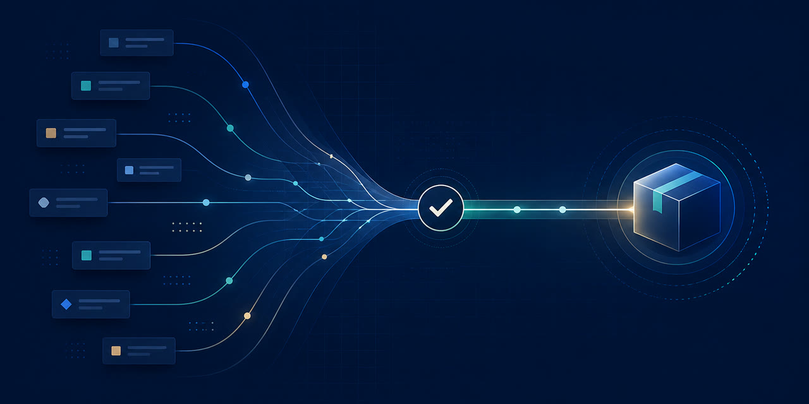

# ProjectPipeline

**A local-first control plane for reliable software delivery.**

ProjectPipeline helps engineering teams turn an idea into a clear plan, coordinate work safely, and verify what was actually delivered. It keeps project decisions, execution state, and release evidence connected so that progress is understandable instead of inferred from a pile of tickets, chats, and dashboards.

> ProjectPipeline is an early-stage project. The repository contains a working Python foundation and a Windows Command Center experience; some integrations and advanced automation paths are still under active development.



## Why ProjectPipeline?

Most delivery tools can record activity. ProjectPipeline focuses on trustworthy outcomes:

- **Plan with context.** Capture project intent, constraints, and architecture in a structured local model.
- **Coordinate safely.** Evaluate ready work, manage dependencies, and keep external changes deliberate.
- **Verify the result.** Tie validation, artifacts, and release checks to the exact work they support.
- **Stay local-first.** Your project state starts on your machine. Optional integrations are explicit and bounded.

## What is included today

The current foundation provides a typed Python CLI, local state and project discovery, dependency-aware work sequencing, validation utilities, release-artifact tooling, and a Windows-oriented Command Center. Provider integrations are optional; ProjectPipeline does not require cloud access to inspect or validate a local project.

## How it works

```text
Project context → clear work model → coordinated execution → verified delivery
```

The tool is designed to make each handoff inspectable. It can capture a project model locally, identify work that is ready, retain the evidence behind a result, and surface the current state in the CLI or Command Center. External services such as GitHub and Jira are optional integrations—not hidden dependencies.

## Who it is for

ProjectPipeline is for developers and engineering teams that want a more reliable way to organize multi-step software work without giving up local control. It is especially useful where a release needs more than a ticket status: it needs a traceable link between the plan, the change, the checks, and the resulting artifact.

## Quick start

Requires Python 3.11–3.13.

```powershell
git clone https://github.com/KevinSGarrett/ProjectPipeline.git
Set-Location ProjectPipeline
python -m venv .venv
.\.venv\Scripts\python.exe -m pip install --upgrade pip
.\.venv\Scripts\python.exe -m pip install -e .
.\.venv\Scripts\project-pipeline.exe doctor --root .
```

On macOS or Linux, activate the virtual environment and use the corresponding `project-pipeline` command.

## Learn more

- [Getting started and development](docs/development/README.md)
- [Architecture overview](docs/architecture/FINAL_ARCHITECTURE.md)
- [CLI and API reference](docs/api/API_REFERENCE.md)
- [Security policy](SECURITY.md)
- [Contributing](CONTRIBUTING.md)

## Project status

ProjectPipeline is in active development. The project is deliberate about status: implemented, planned, and externally dependent capabilities are kept distinct. Please see the documentation and release notes for the current supported surface rather than treating a roadmap as a release promise.

## What this repository contains

- `src/` — the Python package and command-line interface
- `apps/` — the Command Center application surfaces
- `docs/` — product, architecture, API, and developer documentation
- `tests/` — automated behavior and regression coverage
- `schemas/` and `contracts/` — public data and integration contracts

Local project state, editor settings, work tracking, generated evidence, and internal operating material are intentionally excluded from published source.

## Community

Use GitHub Issues for reproducible defects and feature proposals. Discussions are the right place for questions, ideas, and implementation conversations that are not defects. Please read the [Code of Conduct](CODE_OF_CONDUCT.md) before participating.

## Security and license

Please report vulnerabilities privately as described in [SECURITY.md](SECURITY.md). This repository is currently source-available under the terms in [LICENSE](LICENSE); it is **not** presented as an open-source license grant.
