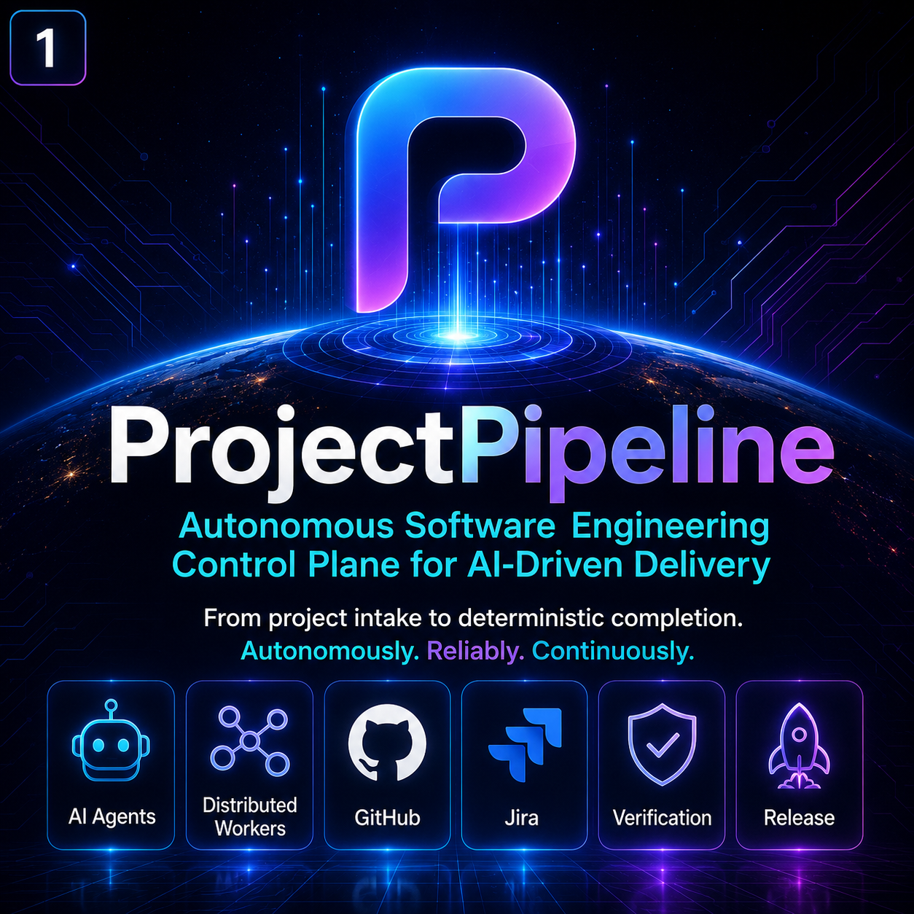
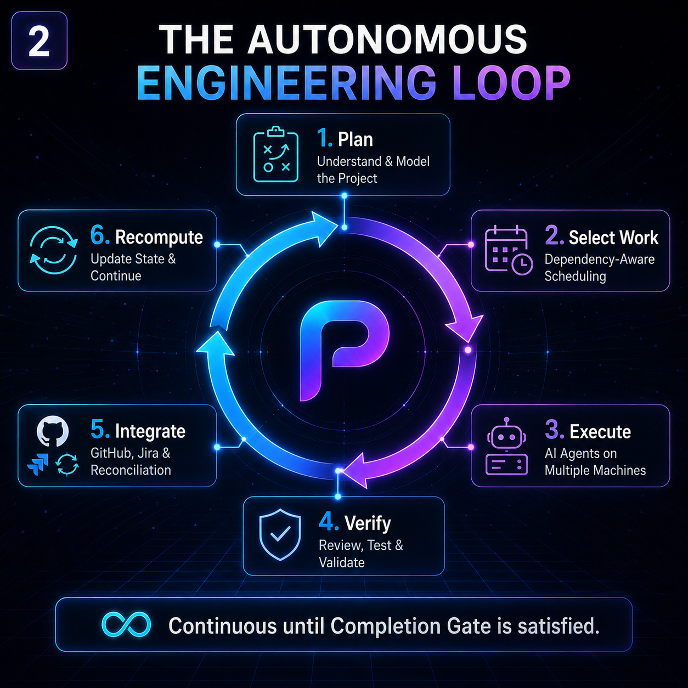

<div align="center">

# ProjectPipeline

### A local-first control plane for AI-driven software delivery

Turn project intent into dependency-aware work, coordinate AI agents and engineering tools safely, and carry every change through verification, integration, and release.

[](https://github.com/KevinSGarrett/ProjectPipeline/actions/workflows/quality.yml)
[](https://github.com/KevinSGarrett/ProjectPipeline/actions/workflows/codeql.yml)
[](https://www.python.org/)
[](#development-status)
[](LICENSE)

[Why ProjectPipeline?](#why-projectpipeline) ·
[Capabilities](#what-it-does) ·
[Quick start](#quick-start) ·
[Architecture](#architecture-at-a-glance) ·
[Documentation](#documentation) ·
[Community](#community)

</div>



## Development status

ProjectPipeline `0.9.0` is in active alpha: its typed Python control plane, CLI, local state model, verification framework, release tooling, and Windows Command Center foundation are working, while production qualification and selected optional integrations continue to mature. Interfaces may change before a stable release.

## Why ProjectPipeline?

AI can generate code quickly. Reliable software delivery still needs deterministic answers to harder questions:

- What work is actually ready, and what does it depend on?
- Which agent, model, machine, or tool is allowed to act?
- What evidence proves the result instead of merely reporting activity?
- How does interrupted work resume without duplicate changes or split-brain execution?
- When do GitHub, Jira, and release state truly agree?

ProjectPipeline connects those decisions in one inspectable, local-first system. It is designed for developers and engineering teams exploring autonomous software engineering, multi-agent workflows, DevOps automation, and evidence-backed release operations without surrendering project authority to a single model or hosted service.

## What it does

| Capability | What ProjectPipeline provides |
| --- | --- |
| **Project intake** | Safely inspects an existing or new project and compiles structured requirements, architecture, constraints, and dependency context. |
| **Deterministic control** | Evaluates readiness, ownership, risk, external preconditions, and completion criteria from explicit project state. |
| **Dependency-aware scheduling** | Selects compatible work, protects shared resources with leases and fencing, and supports conflict-safe parallel lanes. |
| **Provider-neutral agent routing** | Matches bounded tasks to qualified capabilities while keeping provider advice separate from project authority. |
| **Verification and assurance** | Runs profile-driven checks, golden journeys, fault scenarios, and evidence validation before completion claims. |
| **Durable recovery** | Records checkpoints, reconciles uncertain outcomes, isolates failed lanes, and resumes unaffected work. |
| **Governed integrations** | Keeps GitHub and Jira writes typed, scoped, reviewable, and reconciled after execution. |
| **Command Center** | Projects operational state through a Windows-oriented desktop and authenticated local API without making the UI canonical. |
| **Release engineering** | Builds content-addressed artifacts, verifies archives, and carries acceptance evidence to release and post-release checks. |

## The autonomous engineering loop



ProjectPipeline continuously separates observation, decision, execution, and proof:

1. **Plan** — compile project intent, architecture, requirements, and constraints.
2. **Select** — choose dependency-ready work and reserve the necessary resources.
3. **Execute** — dispatch bounded work to qualified local or remote capabilities.
4. **Verify** — test behavior, inspect risk, and retain content-addressed evidence.
5. **Integrate** — govern repository and work-tracker changes through explicit gates.
6. **Recompute** — reconcile state, recover interrupted work, and select the next eligible slice.

The Completion Gate remains independent of workers and integrations: activity, a green local test, or a ticket transition cannot declare the project complete on its own.

## Designed for trustworthy autonomy

### Local-first authority

Canonical project state begins locally. Cloud services, AI providers, GitHub, Jira, and remote workers are optional adapters behind explicit trust and mutation boundaries.

### Evidence over assertions

ProjectPipeline distinguishes source implementation, mock verification, live verification, external blockers, and accepted completion. Each claim can be traced to the checks and artifacts that support it.

### Failure-aware execution

Leases, fencing tokens, idempotency keys, checkpoints, and unknown-outcome reconciliation help the control plane recover safely instead of guessing whether an external operation succeeded.

### Replaceable providers

Models and execution providers are capabilities, not authorities. Routing can evolve without moving scheduling, security, repository, or completion control outside the project.

## Quick start (authorized users)

ProjectPipeline requires **Python 3.11, 3.12, or 3.13**.

Before using these commands, confirm that you are the copyright holder or an explicitly authorized contributor under the [license](LICENSE). Public visibility does not expand the repository's license grant.

### Windows PowerShell

```powershell
git clone https://github.com/KevinSGarrett/ProjectPipeline.git
Set-Location ProjectPipeline

python -m venv .venv
.\.venv\Scripts\Activate.ps1
python -m pip install --upgrade pip
python -m pip install -e .

project-pipeline doctor --root .
project-pipeline validate --root .
```

### macOS or Linux

```bash
git clone https://github.com/KevinSGarrett/ProjectPipeline.git
cd ProjectPipeline

python3 -m venv .venv
. .venv/bin/activate
python -m pip install --upgrade pip
python -m pip install -e .

project-pipeline doctor --root .
project-pipeline validate --root .
```

These commands validate the public source checkout without performing external GitHub, Jira, cloud, or provider writes.

### Explore the CLI

```bash
project-pipeline --help
project-pipeline intake --help
project-pipeline control --help
project-pipeline scheduler --help
project-pipeline agent-router --help
project-pipeline verification --help
project-pipeline assurance --help
project-pipeline command-center --help
```

For a contributor environment with locked runtime and development dependencies, use the [local setup guide](docs/development/setup.md).

## Architecture at a glance

```text
Project inputs
  requirements · code · architecture · constraints
          │
          ▼
Local control plane
  intake · dependency graph · policy · state · evidence
          │
          ▼
Execution layer
  scheduler · agent router · distributed workers · verification
          │
          ▼
Governed outcomes
  GitHub · Jira · artifacts · releases · post-release checks
```

Canonical state and completion authority stay inside the control plane. Operator interfaces and external systems consume or propose changes through owned contracts; they do not become a second source of truth.

## Repository map

| Path | Purpose |
| --- | --- |
| [`src/project_pipeline`](src/project_pipeline) | Typed Python package, CLI, control plane, integrations, verification, and release logic |
| [`apps`](apps) | Command Center application and native desktop surfaces |
| [`architecture`](architecture) | Machine-readable component, trust-boundary, data-flow, and deployment models |
| [`schemas`](schemas) and [`contracts`](contracts) | Public data formats and integration contracts |
| [`docs`](docs) | Architecture, API, development, operations, security, and verification guides |
| [`tests`](tests) | Unit, contract, integration, and end-to-end regression coverage |
| [`infrastructure`](infrastructure) | Optional Windows, container, and hybrid deployment boundaries |

Local work tracking, credentials, generated evidence, editor state, private operating instructions, and maintainer-only delivery records are intentionally excluded from the public source tree.

## Documentation

- [Documentation home](docs/README.md)
- [Architecture baseline](docs/architecture/FINAL_ARCHITECTURE.md)
- [API and CLI reference](docs/api/API_REFERENCE.md)
- [Project intake](docs/intake/README.md)
- [Developer guide](docs/development/README.md)
- [Installation and operations](docs/operations/INSTALLATION_AND_OPERATIONS.md)
- [Completion Gate](docs/assurance/completion_gate.md)
- [Security model](docs/security/security_authority_model.md)
- [Release procedure](docs/release/RELEASE_PROCEDURE.md)

## Community

ProjectPipeline is building a rigorous foundation for local-first AI agents, autonomous engineering workflows, and verifiable software delivery.

- **Found this useful?** [Star the repository](https://github.com/KevinSGarrett/ProjectPipeline) so you can find it again and help others discover it.
- **Want updates?** Watch the repository for release and security activity.
- **Have a question or idea?** Start a [GitHub Discussion](https://github.com/KevinSGarrett/ProjectPipeline/discussions).
- **Found a reproducible problem?** Open a [bug report](https://github.com/KevinSGarrett/ProjectPipeline/issues/new?template=bug_report.yml).
- **Want to contribute?** Read [CONTRIBUTING.md](CONTRIBUTING.md) and the [Code of Conduct](CODE_OF_CONDUCT.md).
- **Need help?** See [SUPPORT.md](SUPPORT.md) for the right channel.

Please report security vulnerabilities privately according to [SECURITY.md](SECURITY.md).

## License

ProjectPipeline is publicly readable and currently **source-available, not open source**. No permission to copy, modify, distribute, sublicense, or sell the software is granted except to the copyright holder and explicitly authorized contributors. See [LICENSE](LICENSE) for the controlling terms.
